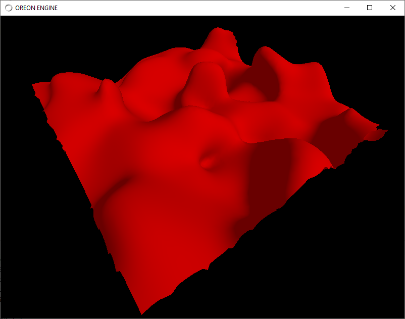
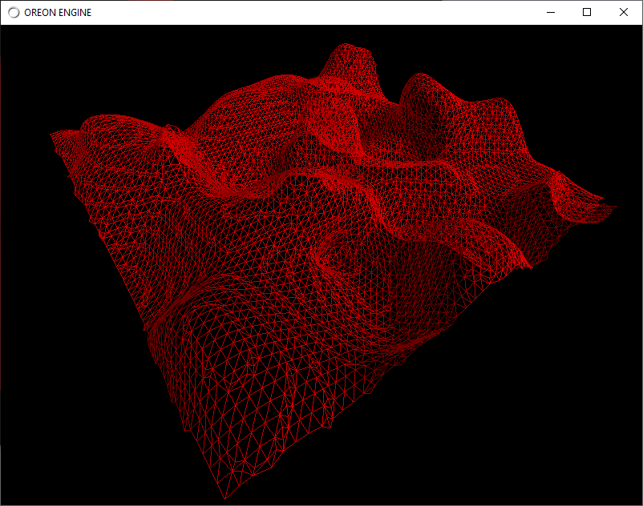

# Simple dual contouring Java LWJGL

Java version of Dual contouring https://github.com/nickgildea/DualContouringSample author Nick Gildea
 
Article: http://ngildea.blogspot.com/2014/11/implementing-dual-contouring.html

## Build Instructions
The dependencies are:
  * Maven
  * Java 11
  * I used IntelliJ IDEA Community edition

 
 

W/S/A/D - forward, backward, left, right

F1 - solid / wireframe

F2 - decrease / increase detalization

middle mouse - camera walking

Use:

Oreon Engine (Java - OpenGL/Vulkan) https://github.com/fynnfluegge/oreon-engine